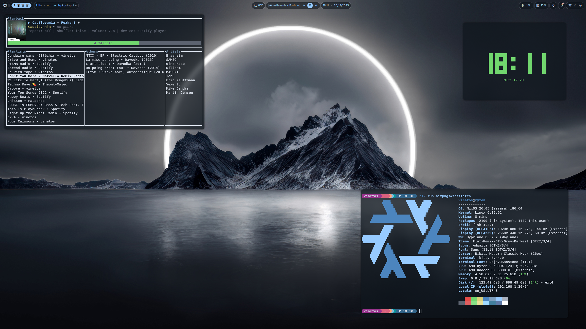

# Vinetos Nix* Configurations

This repository contains all my configurations for all my nix-based systems.
It includes NixOS systems configurations, Nix configurations and nix-darwin configurations with per-user configurations,
and per-host configurations.
This repository is built on top of Nix Flakes and [nixos-unified](https://github.com/srid/nixos-unified).

This config allow me to have per-machine configuration (e.g. modules, hardware specific) AND per-user per-machine
configuration (e.g. profiles, workspaces, ...).

I use this repository to manage my personal computers, servers, and workstations including :

- Laptops with NixOS and MacOS + Nix-Darwin
- Desktop with NixOS
- WSL2 with NixOS and Ubuntu
- Servers with NixOS and Debian + Nix
- Raspberry Pi with NixOS



# What's inside

Some of the noticeable things I use :

- Nix with Flakes built on top of unstable
- Nixos-unified (flake-parts module) to provide a consistent interface for all my configurations
- Home-manager for per-user configuration
- Hyprland with DankLinux / DankMaterialScheme
- Kitty terminal, Fish as shell
- Linux-wallpaper engine, Zen browser

## Architecture

Start from `flake.nix` (see [Flakes](https://nixos.wiki/wiki/Flakes)). [`flake-parts`](https://flake.parts/) is used as
the module system.

### Directory layout

> [!TIP]
> This repo use [autowiring](https://nixos-unified.org/autowiring.html) of flake outputs based on this directory
> structure.

| Directory                                 | Flake Output                                                |
| ----------------------------------------- | ----------------------------------------------------------- |
| `configurations/nixos/foo.nix`[^default]  | `nixosConfigurations.foo`                                   |
| `configurations/darwin/foo.nix`[^default] | `darwinConfigurations.foo`                                  |
| `configurations/home/foo.nix`[^default]   | `legacyPackages.${system}.homeConfigurations.foo`[^hm-pkgs] |
| `modules/nixos/foo.nix`                   | `nixosModules.foo`                                          |
| `modules/darwin/foo.nix`                  | `darwinModules.foo`                                         |
| `modules/flake/foo.nix`                   | `flakeModules.foo`                                          |
| `overlays/foo.nix`                        | `overlays.foo`                                              |
| `packages/foo.nix`                        | `packages.${system}.foo`[^packages]                         |

## How to use

- To add a new host, install it with NixOS Installer or Nix-Darwin, then
    - Create a new directory in `configurations/{nixos/darwin/home}/hostname` depending on underlying OS.
    - Create or move home-manager configurations to `configuration/home/my-user.nix`
    - Copy the generated `configuration.nix` and `hardware-configuration.nix` to the new directory and create the
      `default.nix`.
    - Apply the configuration with `nix run`

- To apply the configuration, run `nix run`
    - You are no required to run it as root, it will ask for sudo password when needed
        ```sh
        nix run # Will update the configuration based on the hostname
        # Or, `nix run .#<computer>`
        ```
- To update NixOS (and other inputs) run `nix flake update`
    - You may also update a subset of inputs, e.g.
      ```sh
      nix flake lock --update-input nixpkgs --update-input darwin --update-input home-manager
      # Or, `nix run .#update`
      ```
- To free up disk space,
  ```sh-session
  sudo nix-env -p /nix/var/nix/profiles/system --delete-generations +2
  sudo nixos-rebuild boot
  ```
- To autoformat the project tree using nixpkgs-fmt, run `nix fmt`.
- To build all flake outputs (locally or in CI), run `nix --accept-flake-config run github:juspay/omnix ci build`


